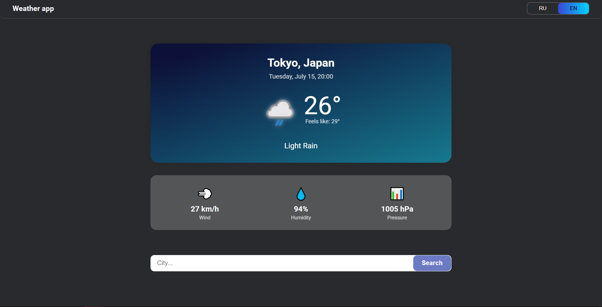
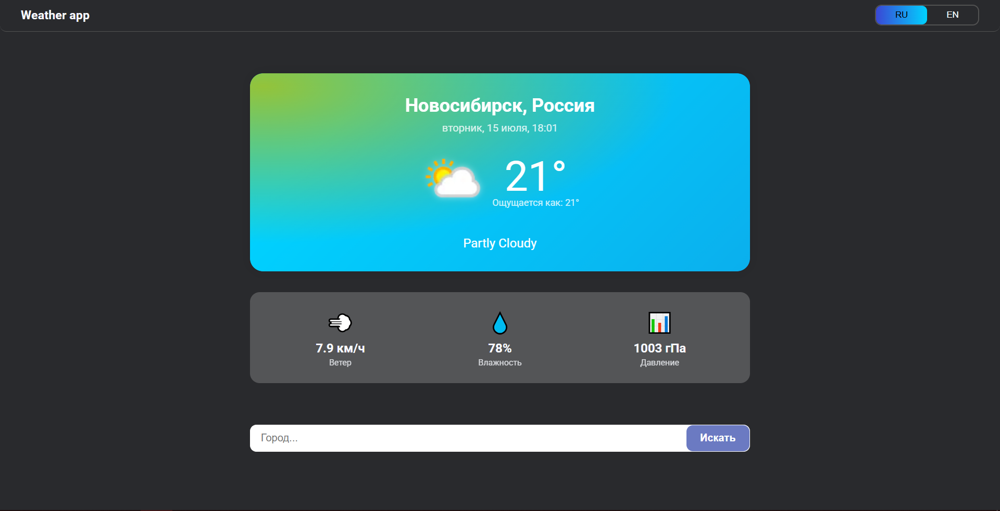

# 🌦️ Weather App with React

Многофункциональное приложение для просмотра погоды с анимированными элементами и поддержкой двух языков.

## ✨ Особенности

- **Текущая погода** по данным WeatherAPI
- **Определение местоположения** (геолокация)
- **Мультиязычный интерфейс** (русский/английский)
- **Анимированные элементы**:
  - Плавные переходы между состояниями
  - Эффект "морозного стекла" (`backdrop-filter`)
  - Интерактивный переключатель языков
- **Адаптивный дизайн** (мобильные/десктоп)

## 🛠 Технологии

  
  
  
  

## 🚀 Быстрый старт

### Установка

- git clone https://github.com/AlexeyNizovtsev/weather-app.git
- cd weather-app
- npm install

### Настройка окружения

- Зарегистрируйтесь на сайте https://www.weatherapi.com
- Получите ваш api ключ
- Создайте файл .env в корне проекта:
  - VITE*WEATHER_API_KEY=ваш*ключ_от_weatherapi

### Запуск

npm run dev

### Сборка для production

npm run build

## 🌍 Мультиязычность

Приложение поддерживает два языка:

- Русский (по умолчанию)
- Английский

Реализовано через Context API с динамической загрузкой переводов.

## 🎨 Анимации в проекте

| Элемент              | Анимация          | Ключевые кадры (`@keyframes`)                                                             | Свойства            | Длительность | Тайминг-функция                       | Эффект                 |
| -------------------- | ----------------- | ----------------------------------------------------------------------------------------- | ------------------- | ------------ | ------------------------------------- | ---------------------- |
| Загрузка карточки    | `pulseOpacity`    | 0%: opacity: 0.6 50%: opacity: 0.2 100%: opacity: 0.6                               | opacity             | 1s           | `ease-in-out`                         | Пульсация прозрачности |
| Появление элементов  | `fadeIn`          | from: opacity: 0, transform: translateY(20px) to: opacity: 1, transform: translateY(0) | opacity, transform  | 1s           | `ease-out`                            | Плавное всплытие       |
| Дневной фон карточки | `gradient-pulse`  | 0%,100%: opacity: 0 50%: opacity: 1                                                    | opacity, background | 10s          | `ease-in-out`                         | Мерцание градиента     |
| Ночной фон карточки  | `gradient-pulse`  | 0%,100%: opacity: 0 50%: opacity: 1                                                    | opacity, background | 10s          | `ease-in-out`                         | Мерцание градиента     |
| Переключатель языка  | slider transition | -                                                                                         | transform           | 0.8s         | `cubic-bezier(1, -0.55, 0.265, 1.55)` | Эффект "пружины"       |

### Особенности реализации:

- **Для фонов карточки** используется комбинация:

  - .weather-card::before { /_ основной градиент _/ }
  - .weather-card::after { /_ анимируемый поверх _/ }

- **Переключатель языка имеет**:

  - Плавное изменение цвета текста (transition: color 0.8s ease)
  - Сложную траекторию движения ползунка через cubic-bezier

- **Все анимации работают на CSS без JavaScript**

## 🔧 Возможные улучшения

- Добавить прогноз на 3 дня
- Реализовать выбор темы (темная/светлая)
